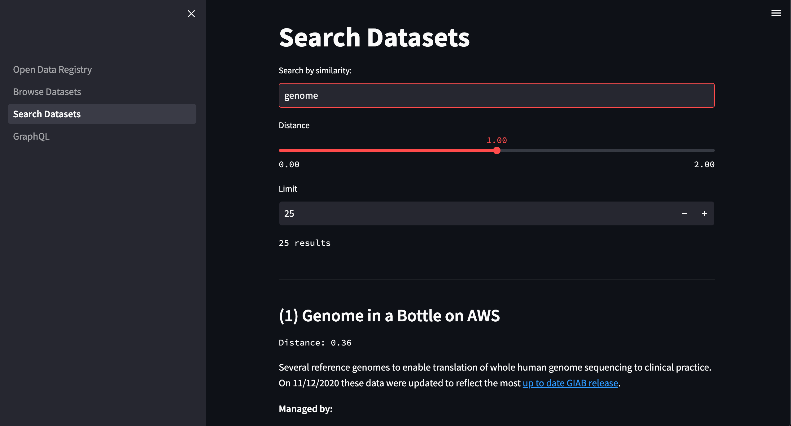
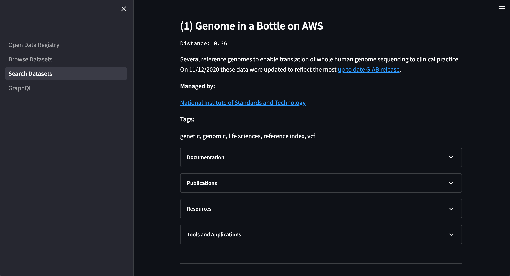
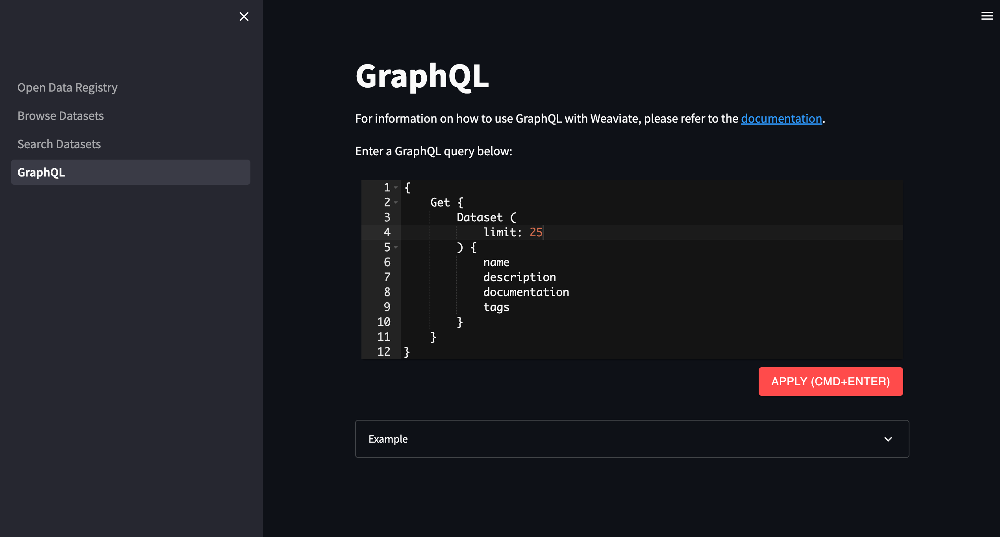

# aws-open-data-registry-neural-search
Semantic search of [AWS Open Data Registry](https://registry.opendata.aws/) datasets using Weaviate.

## <a name='TableofContents'></a>Table of Contents
* [Table of Contents](#TableofContents)
* [Project Structure](#ProjectStructure)
* [Description](#Description)
    * [Architecture](#Architecture)
	* [Deployment using Makefile](#DeploymentusingMakefile)
* [Quickstart](#Quickstart)
* [Installation](#Installation)
	* [Prerequisites](#Prerequisites)
	* [Environment Variables](#EnvironmentVariables)
	* [CDK Application Configuration](#CDKApplicationConfiguration)
	* [AWS Credentials](#AWSCredentials)
	* [Python Development](#PythonDevelopment)
	* [Weaviate Configuration](#WeaviateConfiguration)
		* [Download the Docker Compose File](#DownloadtheDockerComposeFile)
		* [Update the Docker Compose File](#UpdatetheDockerComposeFile)
		* [Run the Docker Compose File](#RuntheDockerComposeFile)
* [Usage](#Usage)
	* [Makefile](#Makefile)
	* [Docker](#Docker)
	* [AWS Deployment](#AWSDeployment)
	* [Weaviate](#Weaviate)
		* [Create the Schema](#CreatetheSchema)
	* [CDK Commands](#CDKCommands)
* [Troubleshooting](#Troubleshooting)
* [References & Links](#ReferencesLinks)
* [Authors](#Authors)

## <a name='ProjectStructure'></a>Project Structure
```bash
.
├── Makefile                # Makefile for deployment and teardown
├── README.md
├── (aws-open-data-registry-neural-search-key-pair.pem)
├── bin                     # CDK app
├── cdk.context.json
├── cdk.json
├── config.json             # Environment variables for CDK app
├── frontend                # Streamlit app
├── lib                     # CDK stacks
├── notebooks
├── package.json
├── requirements.txt
├── scripts                 # Bash scripts for Weaviate
├── src                     # EC2 instance user data
├── tasks                   # Fargate task
└── tsconfig.json
```

## <a name='Description'></a>Description
Deploy and load a Weaviate instance with [AWS Open Data Registry](https://registry.opendata.aws/) datasets. Find datasets, tutorials, publications and tools & applications using semantic search queries using the Streamlit app.

### Architecture
The application deploys the following resources.
* EC2 instance
* VPC (optional)
* Fargate task (run on AWS Batch)

### <a name='DeploymentusingMakefile'></a>Deployment using Makefile
Once the environment is configured the application can be deployed using one command, `make app`. This will create the infrastructure including setting up and exposing the Weaviate instance, load the data, and start the Streamlit server once loading is finished.

#### SSH Key
The SSH key is created and deleted outside of the CDK app using Makefile targets, which means that you can run `cdk deploy` and `cdk destroy` without having to create or delete the SSH key. If the key's `.pem` file is detected in the project it will be assigned to the database instance. If no key is found, it must be created *before* the AWS resources are deployed. The best way to do this is by running `make app` or `make deploy`

#### Streamlit Frontend
The Streamlit app is where you can interact with Weaviate by browsing, searching, and executing GraphQL queries.



Each dataset has several expandable sections containing information about it.



Custom queries can be run against Weaviate using the GraphQL API.



## <a name='Quickstart'></a>Quickstart
1. Configure your AWS credentials.
2. Add environment variables to `.env`.
3. Update the `tags` field in `config.json` if desired.
4. Run `npm install` to install.
5. Run `make app` to deploy, load data and start the Streamlit server.

## <a name='Installation'></a>Installation
Follow the steps to configure the deployment environment.

### <a name='Prerequisites'></a>Prerequisites
* Nodejs >= 18.0.0
* TypeScript >= 4.4.3
* AWS CDK >= 2.53.0
* AWSCLI
* Docker
* Python 3.10
* jq

### <a name='EnvironmentVariables'></a>Environment Variables
Sensitive environment variables containing secrets like passwords and API keys must be exported to the environment first.

Create a `.env` file in the project root.
```bash
CDK_DEFAULT_ACCOUNT=<account_id>
CDK_DEFAULT_REGION=<region>
```

***Important:*** *Always use a `.env` file or AWS SSM Parameter Store or Secrets Manager for sensitive variables like credentials and API keys. Never hard-code them, including when developing. AWS will quarantine an account if any credentials get accidentally exposed and this will cause problems.*

***Make sure that `.env` is listed in `.gitignore`***

### <a name='CDKApplicationConfiguration'></a>CDK Application Configuration
The CDK application configuration is stored in `config.json`. This file contains values for the database layer, the data ingestion layer, and tags. You can update the tags and SSH IP to your own values before deploying.
```json
{
    "layers": {
        "data_ingestion": {
            "env": {
                "repo_url": "https://github.com/awslabs/open-data-registry",
                "target_data_dir": "datasets"
            }
        },
        "vector_database": {
            "env": {
                "ssh_cidr": "0.0.0.0/0", // Update to your IP
                "ssh_key_name": "aws-open-data-registry-neural-search-key-pair"
            }
        }
    },
    "tags": {
        "org": "my-organization", // Update to your organization
        "app": "aws-open-data-registry-neural-search"
    }
}
```

### <a name='AWSCredentials'></a>AWS Credentials
Valid AWS credentials must be available to AWS CLI. The easiest way to do this is running `aws configure`, or by adding them to `~/.aws/credentials` and exporting the `AWS_PROFILE` variable to the environment.

For more information visit the documentation page:
[Configuration and credential file settings](https://docs.aws.amazon.com/cli/latest/userguide/cli-configure-files.html)

<!-- ### <a name='JupyterNotebookSetup'></a>Jupyter Notebook Setup
To use the virtual environment inside Jupyter Notebook, first activate the virtual environment, then create a kernel for it.
```bash
# Install ipykernal and dot-env
pip install ipykernel python-dotenv

# Add the kernel
python3 -m ipykernel install --user --name=<environment name>

# Delete the kernel
jupyter kernelspec uninstall <environment name>
``` -->

### <a name='PythonDevelopment'></a>Python Development
Create a virtual environment for Python development.
```bash
# Create a virtual environment
python3.10 -m venv .venv

# Activate the virtual environment
source .venv/bin/activate

# Upgrade pip
pip install --upgrade pip

# Install dependencies
pip install -r requirements.txt
```

### <a name='WeaviateConfiguration'></a>Weaviate Configuration
Configuring Weaviate requires 3 steps:
1. Download the Docker Compose file.
2. Update the Docker Compose file to configure Weaviate to persist data and automatically restart on reboot.
3. Run the Docker Compose file.

#### <a name='DownloadtheDockerComposeFile'></a>Download the Docker Compose File
Run the command to download a Docker Compose file for Weaviate ([source](https://weaviate.io/developers/weaviate/installation/docker-compose)).
```bash
curl -o docker-compose.yaml "https://configuration.weaviate.io/v2/docker-compose/docker-compose.yml?generative_cohere=false&generative_openai=false&generative_palm=false&gpu_support=false&media_type=text&modules=modules&ner_module=false&qna_module=false&ref2vec_centroid=false&runtime=docker-compose&spellcheck_module=false&sum_module=false&text_module=text2vec-transformers&transformers_model=sentence-transformers-multi-qa-MiniLM-L6-cos-v1&weaviate_version=v1.19.8"
```

#### <a name='UpdatetheDockerComposeFile'></a>Update the Docker Compose File
Next, run the command to configure Weaviate to persist data and automatically restart on reboot.
```bash
awk '
  /^  weaviate:$/ {
    print
    print "    restart: always"
    print "    volumes:"
    print "      - /data/weaviate:/var/lib/weaviate"
    while(getline && $0 !~ /^  /);
    if ($0 ~ /^  /) {
      print
    }
    next
  }
  /^  t2v-transformers:$/ {
    print
    print "    restart: always"
    while(getline && $0 !~ /^  /);
    if ($0 ~ /^  /) {
      print
    }
    next
  }
  /CLUSTER_HOSTNAME: '\''node1'\''/ {
    print
    print "      AUTOSCHEMA_ENABLED: '\''false'\''"
    next
  }
  /restart: on-failure:0/ {
    next
  }
  1' docker-compose.yaml > docker-compose-temp.yaml && mv docker-compose-temp.yaml docker-compose.yaml
```

#### <a name='RuntheDockerComposeFile'></a>Run the Docker Compose File
Finally, run the command to start Weaviate.
```bash
docker-compose up -d
```

## <a name='Usage'></a>Usage

### <a name='Makefile'></a>Makefile
```bash
# Deploy and run the app
make app

# Deploy AWS resources
make deploy

# Destroy the application
make destroy

# Run the Batch job to load the database. Saves output to job.json
make job.run

# Reads job.json and checks the job status
make job.status

# Get the status of Weaviate
make weaviate.status

# Stop Weaviate
make weaviate.stop

# Start Weaviate
make weaviate.start

# Restart Weaviate
make weaviate.restart

# Get the endpoint for Weaviate
make weaviate.get.endpoint

# Create the Weaviate schema
make weaviate.schema.create

# Delete the Weaviate schema
make weaviate.schema.delete

# Run the Streamlit frontend
make streamlit.run
```

### <a name='Docker'></a>Docker
Build the application.
```bash
cd tasks/load_odr
docker build -t load_odr:latest .
```
Run the application.
```bash
docker run -d --env-file ../.env load_odr:latest
```

### <a name='Weaviate'></a>Weaviate

#### <a name='CreatetheSchema'></a>Create the Schema
```bash
make weaviate.schema.create
```

#### <a name='DeletetheSchema'></a>Delete the Schema
```bash
make weaviate.schema.delete
```

### <a name='CDKCommands'></a>CDK Commands

* `npm run build`   compile typescript to js
* `npm run watch`   watch for changes and compile
* `npm run test`    perform the jest unit tests
* `cdk deploy`      deploy this stack to your default AWS account/region
* `cdk diff`        compare deployed stack with current state
* `cdk synth`       emits the synthesized CloudFormation template

## <a name='Troubleshooting'></a>Troubleshooting
* Check your AWS credentials in `~/.aws/credentials`
* Check that the environment variables are available to the services that need them
* Check that the correct environment or interpreter is being used for Python

## <a name='ReferencesLinks'></a>References & Links
- [AWS Open Data Registry](https://registry.opendata.aws/)
- [Weaviate Docuentation](https://www.semi.technology/developers/weaviate/current/index.html)
- [Weaviate GraphQL API](https://weaviate.io/developers/weaviate/current/graphql-references/index.html)
- [Weaviate Docker Compose](https://weaviate.io/developers/weaviate/installation/docker-compose)

## <a name='Authors'></a>Authors
**Primary Contact:** [@chrisammon3000](https://github.com/chrisammon3000)
